# java简单学习
***

## 基本语法注意事项
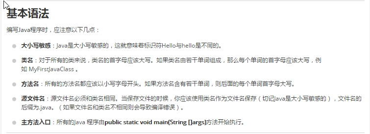
## 枚举
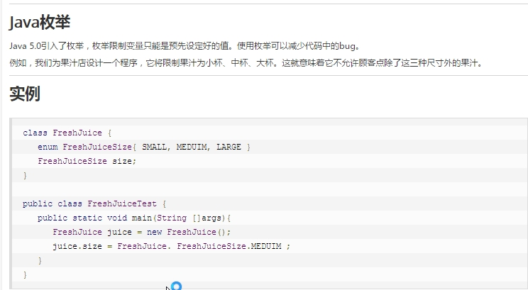
## 源文件申明规则
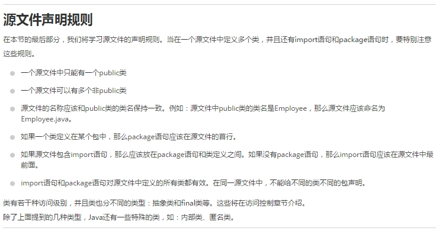
## 引用类型
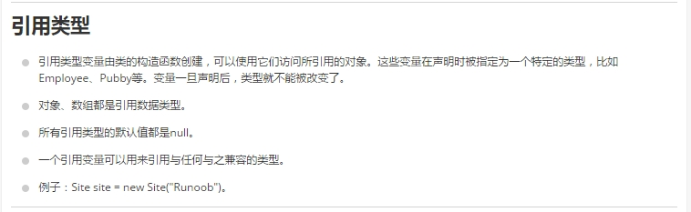
## 常量
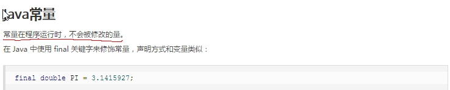

```java
import java.io.*;
public class Employee{
   // 这个成员变量对子类可见
   public String name;
   // 私有变量，仅在该类可见
   private double salary;
   //在构造器中对name赋值
   public Employee (String empName){
      name = empName;
   }
   //设定salary的值
   public void setSalary(double empSal){
      salary = empSal;
   }
   // 打印信息
   public void printEmp(){
      System.out.println("name  : " + name );
      System.out.println("salary :" + salary);
   }

   public static void main(String args[]){
      Employee empOne = new Employee("Ransika");
      empOne.setSalary(1000);
      empOne.printEmp();
   }
}
```
## 实例变量
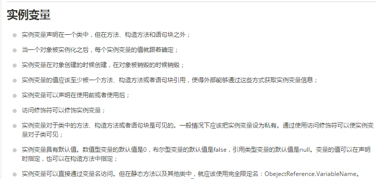
```java
import java.io.*;
public class Employee {
    //salary是静态的私有变量
    private static double salary;
    // DEPARTMENT是一个常量
    public static final String DEPARTMENT = "开发人员";
    public static void main(String args[]){
    salary = 10000;
        System.out.println(DEPARTMENT+"平均工资:"+salary);
    }
}
```

## 访问修饰符
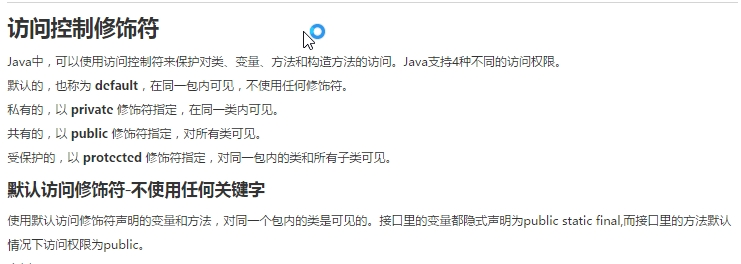

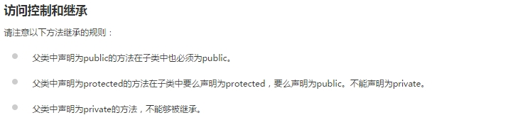

## 位运算符
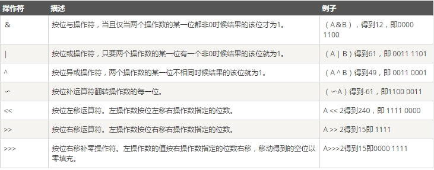
```java
package com.jerry.www;

/**
 * Created by Jerry on 2016/6/3.
 */
public class BinaryTest {
    public static void main(String args[]) {
        int a = 60; /* 60 = 0011 1100 */
        int b = 13; /* 13 = 0000 1101 */
        int c = 0;
        c = a & b;       /* 12 = 0000 1100 */
        System.out.println("a & b = " + c );

        c = a | b;       /* 61 = 0011 1101 */
        System.out.println("a | b = " + c );

        c = a ^ b;       /* 49 = 0011 0001 */
        System.out.println("a ^ b = " + c );

        c = ~a;          /*-61 = 1100 0011 */
        System.out.println("~a = " + c );

        c = a << 2;     /* 240 = 1111 0000 */
        System.out.println("a << 2 = " + c );

        c = a >> 2;     /* 15 = 1111 */
        System.out.println("a >> 2  = " + c );

        c = a >>> 2;     /* 15 = 0000 1111 */
        System.out.println("a >>> 2 = " + c );
    }
}
```

## 赋值运算符
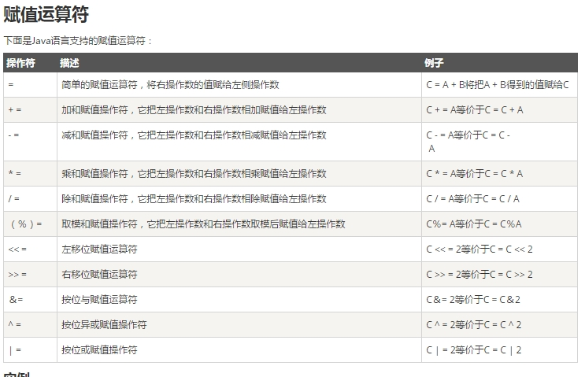

```java
public class Test {
  public static void main(String args[]) {
     int a = 10;
     int b = 20;
     int c = 0;
     c = a + b;
     System.out.println("c = a + b = " + c );
     c += a ;
     System.out.println("c += a  = " + c );
     c -= a ;
     System.out.println("c -= a = " + c );
     c *= a ;
     System.out.println("c *= a = " + c );
     a = 10;
     c = 15;
     c /= a ;
     System.out.println("c /= a = " + c );
     a = 10;
     c = 15;
     c %= a ;
     System.out.println("c %= a  = " + c );
     c <<= 2 ;
     System.out.println("c <<= 2 = " + c );
     c >>= 2 ;
     System.out.println("c >>= 2 = " + c );
     c >>= 2 ;
     System.out.println("c >>= a = " + c );
     c &= a ;
     System.out.println("c &= 2  = " + c );
     c ^= a ;
     System.out.println("c ^= a   = " + c );
     c |= a ;
     System.out.println("c |= a   = " + c );
  }
}
```

## java增强for语句
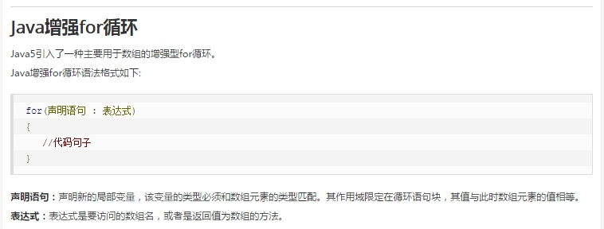

```java
public class Test {

   public static void main(String args[]){
      int [] numbers = {10, 20, 30, 40, 50};

      for(int x : numbers ){
         System.out.print( x );
         System.out.print(",");
      }
      System.out.print("\n");
      String [] names ={"James", "Larry", "Tom", "Lacy"};
      for( String name : names ) {
         System.out.print( name );
         System.out.print(",");
      }
   }
}
```

## Number类
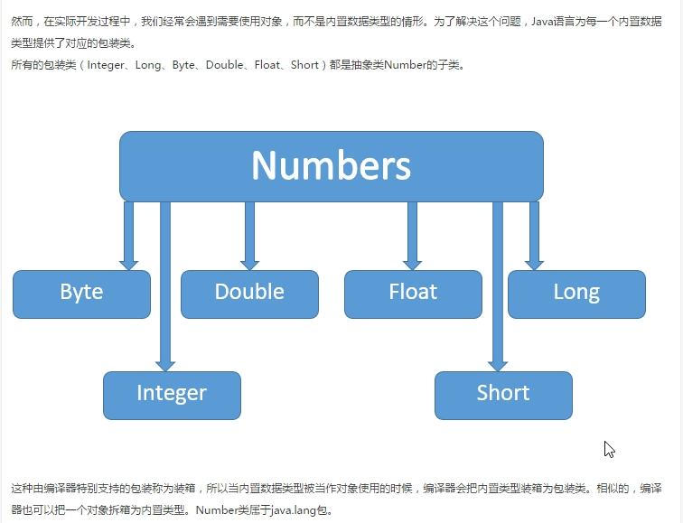

## String注意
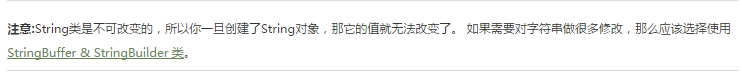

***
## Created by[xiaotian](xiaotian.html)

